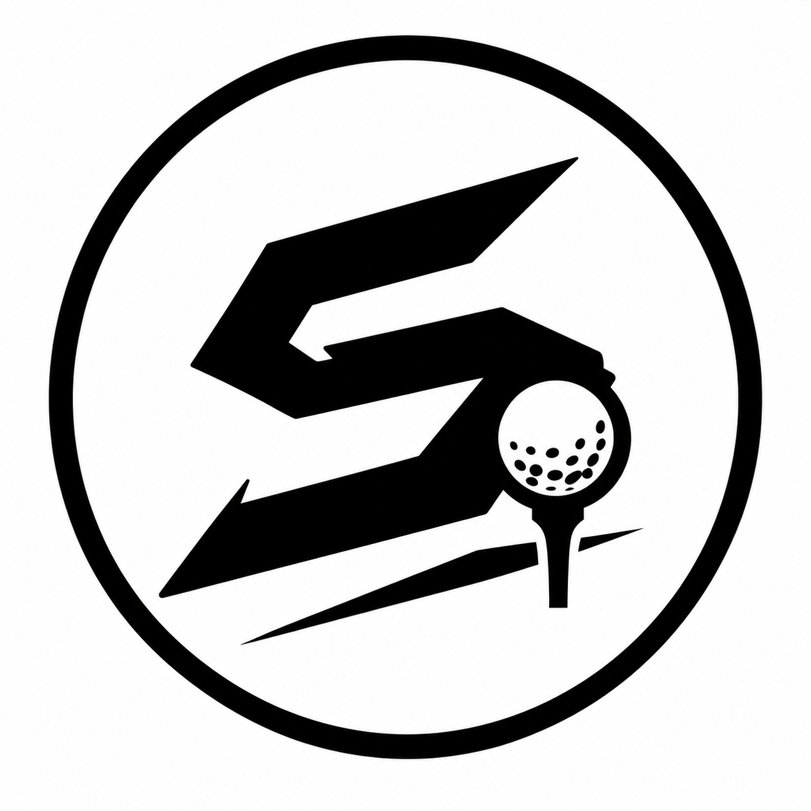

<p align="center">
  
</p>

<h1 align="center">State of Stick Golf</h1>

<p align="center"><strong>The physical course. The digital doorway. The round that keeps going.</strong></p>

<p align="center"><a href="https://golf.stateofstick.co">Explore Golf</a> · <a href="https://stateofstick.co">State of Stick, Co.</a> · <a href="docs/network-model.md">Network model</a> · <a href="docs/golf-intelligence.md">Golf Intelligence</a></p>

<p align="center">  </p>

> **Public-repository boundary.** This repository is the golf-specific vertical and pilot application for State of Stick, Co. Shared platform authority, proprietary physical-object mechanisms, credentials, production identity details, and other non-public operational material remain outside this repository. The current build contains demonstration data and does not imply a live partner, production adoption, revenue, payment flow, or independently validated golf data.

| PHYSICAL COURSE | DIGITAL DOORWAY | TRUSTED MEMORY |
| --- | --- | --- |
| Flagsticks, tee markers, carts, clubhouse moments, and course touchpoints | Course context, round entry, services, leagues, events, and useful questions | Official strokes, verified interactions, passport history, and bounded intelligence kept distinct |

**Golf vertical · StickLink Golf · Player passport · Course operations · Portable competition · Golf Intelligence**

## What State of Stick Golf is

State of Stick Golf is the golf vertical of State of Stick, Co.: a physical-world network for golfers and course operators. It connects the moments that happen on a course to a useful digital destination without asking a course to replace its tee sheet, handicap authority, POS, or course-management system.

The physical product earns its place first. A numbered medallion, tee marker, cart tag, tournament sign, service point, or other approved touchpoint can become a doorway to the right golf context at the right moment.

Golf is not a second identity or commerce platform. State of Stick remains the authority for people, organizations, roles, entitlements, physical identity, commerce, payments, attribution, and governed AI policy. This repository owns golf-specific records and experiences: courses, holes, rounds, score context, leagues, events, services, operator workflows, and golf intelligence.

## What the app does for people

### For a golfer

Golf gives a player one useful place for the round: tap into the course, see the right hole or service context, record official strokes, keep physical verification separate, and carry the finished round into a passport. A player can discover courses, join a portable league, follow an event, collect course moments, and understand what a record actually proves.

### For a course operator

Golf turns approved course knowledge and physical touchpoints into an operating layer. Staff can publish course context, manage tap points, review course claims, activate tee-time arrivals, review round and verification queues, fulfill service requests, publish announcements, and see recorded participation without replacing the tee sheet, POS, handicap system, or course-management software.

### For a league or event

Golf makes competition portable. A league can define eligible courses, format rules, evidence requirements, standings, check-in, challenges, and event moments while keeping each round's course, tees, score, and trust level attached. The system explains standings; it does not invent official results or decide winners through AI.

### What the AI does

Golf Intelligence is a bounded assistant over approved golf records. It can explain a round, summarize a league movement, answer a narrow course question, prepare an operator shift brief, identify unanswered topics, and suggest where a person may investigate next. It shows the source facts and provenance behind an answer.

The AI cannot create an official score, change a standing, invent a course condition, set a price, fulfill an order, publish a rule, expose another player's private data, or take a consequential staff action. When approved context is missing, it says so. The first provider is deterministic rules logic; a future model provider remains subject to the same source, authorization, and provenance boundaries.

## The product in three layers

### ① Course — the physical moment

Approved touchpoints can open hole context, enter a round, request a service, save a memory, or find the next useful action. A tap proves interaction context; it does not silently prove strokes, handicap, yardage, or an official result.

### ② Round — the trusted record

| Record | What it means |
| --- | --- |
| Official strokes | Recorded strokes or an approved external authority's result |
| Format points | Deterministic Stableford, match-play, or other competition context |
| Physical proof | Tap, witness, course, operator, or verification events |
| Passport history | The golfer's durable memory of participation and achievement |
| Intelligence | Advisory interpretation of authorized records |

### ③ Network — the next visit

Courses, golfers, leagues, events, operators, services, and physical objects form a permissioned network. A round can travel, a player can keep a passport, a course can understand recorded participation, and an operator can act on a queue without losing the source record.

## Trust levels

| Level | Evidence | Safe interpretation |
| --- | --- | --- |
| Self-reported | Player entry or note | A golfer reported an event or score |
| Partner-attested | Witness or partner confirmation | Another participant confirmed the interaction |
| Course-confirmed | Approved operator or course event | The course recorded or approved the context |
| Commissioner-approved | League or event authority review | The competition record was reviewed within its rules |
| Officially integrated | Approved external authority | The result came from an authoritative integration |

The application never turns a prompt, tap, AI response, or self-report into an official record by implication.

## Golf Intelligence™

The default provider is a deterministic rules engine that explains only from authorized golf records and returns source facts, interpretation, confidence, timestamp, rule version, provider identifier, and provenance status.

The course assistant can answer narrow questions from approved course knowledge. It refuses unsupported live conditions, private-player questions, medical or gambling advice, and unverified official claims. It does not write scores, alter standings, set prices, fulfill services, publish announcements, or take staff action.

Read [`docs/golf-intelligence.md`](docs/golf-intelligence.md) and [`docs/product-brand-architecture.md`](docs/product-brand-architecture.md).

## What the pilot contains

### Golfer surfaces

- `/` — connected-fairway entry and the physical Golf story
- `/round/cedar-ridge/` — working scorecard with official, format, verification, and recovery views
- `/passport/` — player-owned golf read model for rounds, courses, achievements, and season history
- `/tap/cedar-ridge/turn-house/` — physical touchpoint experience
- `/discover/` — provider-neutral course discovery with map and list views
- `/network/` — golfer, course, league, and physical-graph view
- `/league/anywhere/` — portable multi-course season and shared standings
- `/events/state-of-stick-invitational/` — event identity and leaderboard concept

### Course and operator surfaces

- `/course/cedar-ridge/` — course profile, hole context, approved knowledge, and touchpoints
- `/course/cedar-ridge/services/` — published service catalog and golfer request path
- `/operator/` — course-side activity and activation view
- `/operator/onboard/` — course claim and review workflow
- `/operator/rounds/` — round review and verification queue
- `/operator/tee-times/` — bounded tee-time activation workflow
- `/operator/services/` — operator-controlled service fulfillment
- `/operator/analytics/` — recorded participation and activity metrics
- `/pitch/` — owner-facing Golf brief and operating opportunity

## Platform architecture

Edge-first and free-first: the experience can begin with local course diagrams and approved records before requiring richer providers or paid capabilities.

| Layer | Technology / boundary |
| --- | --- |
| Experience | Astro 7, prerendered Golf routes, shared dark-first brand system |
| API | Cloudflare Worker with validated public reads and authenticated writes |
| Database | Cloudflare D1 for authoritative golf records and migrations |
| Live coordination | Durable Objects for round/session overlays; D1 remains authoritative when cold |
| Intelligence | Deterministic rules engine first; bounded Workers AI course-assistant path |
| Identity | State of Stick session and verified assertions; Golf does not create a second identity authority |
| Events | Platform outbox to State of Stick for downstream identity, entitlement, analytics, and commercial workflows |
| Offline path | Browser IndexedDB for pending round work, retry, witness confirmation, and duplicate-safe sync |

```text
course touchpoint
        │
        ▼
approved golf context ──→ golfer round / service / passport
        │                            │
        ▼                            ▼
course operator ───────→ Golf Intelligence™
        │                            │
        └──────── State of Stick platform boundary ────────┘
```

## Repository layout

```text
src/
├── layouts/        # Global shell, SEO, brand navigation, and footer
├── lib/            # Golf domain rules, course graph, operator services, intelligence
├── pages/           # Golfer, course, operator, league, event, and pitch routes
└── styles/          # Global tokens and responsive visual system

worker/src/          # Cloudflare Worker API, D1 access, auth, events, and DO coordination
migrations/          # Ordered D1 schema migrations
docs/                # Network, league, map, identity, intelligence, and manufacturing boundaries
public/brand/        # Golf logo, product photography, and brand assets
public/art/          # Course, medallion, emblem, and concept artwork
tests/               # Deterministic rules, API contracts, provenance, and authorization tests
```

## Local development

```bash
npm install
npm run dev          # http://localhost:4321
npm run build        # static production build in dist/
npm run check        # Astro diagnostics and TypeScript checks
npm test             # node:test suite
npm run api:check    # Worker type-check without emitting files
npm run api:dev      # local Worker API through npx wrangler
```

Generated `dist/`, `.astro/`, and `.wrangler/` directories are not committed. Use `npx wrangler` with `worker/wrangler.jsonc` for Cloudflare operations. Secrets belong in ignored local files or Cloudflare secret storage, never in this repository.

## What is live, what is not

The repository contains a functional pilot surface and a growing Worker/D1/DO foundation. Local builds, deterministic tests, and pushed Git history are verifiable here. A live route, course name, score, operator screen, or demo asset is not evidence of a live partner, production adoption, settled revenue, sponsor attribution, or independently validated golf data.

Before production readiness, verify independently: the commit and branch, Pages Git connection, custom domain, intended route, D1 database and migration chain, identity integration, secrets, hostname, tenancy, and live probes.

## Brand system

Golf follows the State of Stick system while keeping a player-first voice:

- **Foundation:** ink `#07090a`, steel `#f5f6f7`, rust `#e85d2f`, precision cyan `#0abab5`
- **Display:** condensed, uppercase, physical, editorial
- **Body:** clear, useful, and concrete
- **Golf framing:** scorekeeping, trusted records, portable leagues, participation, and competition
- **Product boundary:** the object is physical, the doorway is useful, and the record states what it actually proves

The detailed naming and product hierarchy live in [`docs/product-brand-architecture.md`](docs/product-brand-architecture.md). Manufacturing and field-installation boundaries live in [`docs/physical-network-and-manufacturing.md`](docs/physical-network-and-manufacturing.md).

© State of Stick, Co. · State of Stick Golf · Made in Battle Creek, Michigan · Built to Stick. Made to Last.
